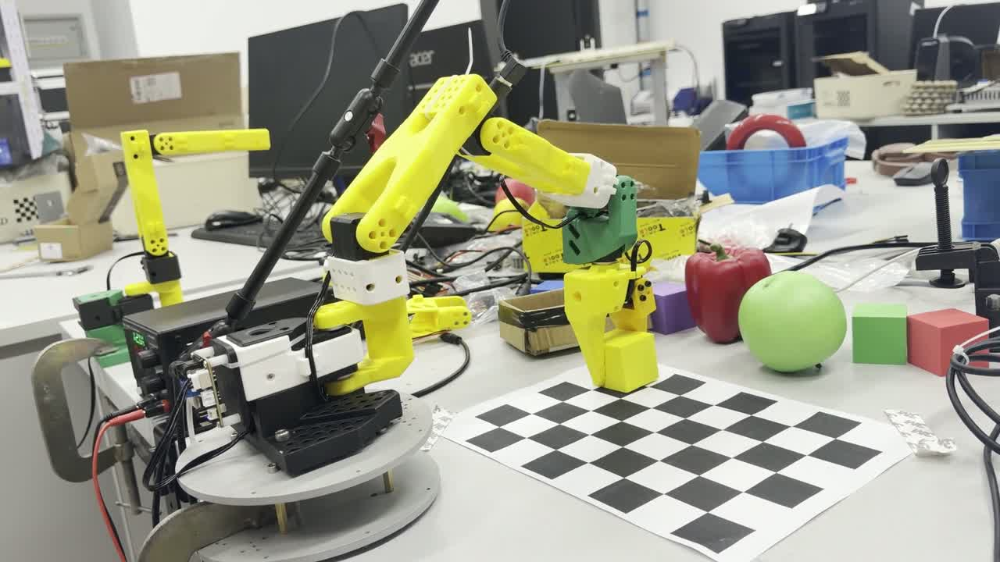

<div align="center">

# 千里 · QianLi

> **千里之行，始于足下。** _A journey of a thousand miles begins with a single step._

**Autonomous Mobile Manipulator × Semantic Navigation × Embodied Agent**

一个面向室内复杂环境的自主探索、语义认知与任务执行移动机器人项目。


---

</div>

## 分支与验证范围 · Branches

下表描述各分支的实现范围（2026-10-09 核对）。Humble 是机械臂迁移基线；移动仿真实验仍使用 Jazzy，尚未完成跨分支集成。

| 分支 | 用途 | 环境与边界 |
|---|---|---|
| [main](https://github.com/Suerzong/QianLi/tree/main) | 默认项目入口、机械臂历史实现与阶段视频 | 历史运行环境为 Ubuntu 24.04/Jazzy；文档更新不表示迁移或移动仿真代码已经合入 |
| [codex/ubuntu22-humble](https://github.com/Suerzong/QianLi/tree/codex/ubuntu22-humble)（本分支） | SO-101、视觉、MuJoCo 与训练的 Humble 迁移 | Ubuntu 22.04.5/Humble/Python 3.10 VM + Windows CUDA；原生 Linux 与新环境真机运动/抓取待验收 |
| [codex/cloud-model-training](https://github.com/Suerzong/QianLi/tree/codex/cloud-model-training) | Omni 移动仿真、教学楼场景、SLAM/Nav2、Frontier 与 CPU CEM 参数学习 | Ubuntu 24.04/Jazzy/Gazebo Harmonic；有独立仿真验证，Humble 兼容及整机集成尚未验收 |

Humble 分支从 `main` 的 `7bc7154` 分出；移动仿真分支与它们的共同祖先为 `2f5c871`，两条开发线存在独立提交。各分支的包数量、算法与成绩分别记录：机械臂 PPO/BC 与移动避障 CPU CEM 不属于同一训练任务。切换分支后使用独立工作区或重新构建，避免混用旧 `build/install`；也不要在一个 shell 中混合 Humble 与 Jazzy。

## 项目简介 · About

**QianLi（千里）** 是一款面向**室内复杂环境**的自主移动操作机器人 —— 它探索未知的空间，理解世界的语义，并动手完成任务。

取名自《道德经》"千里之行，始于足下"：每一个复杂的系统，都始于一段能跑通的代码。

### 最终目标

- 🌍 **自主探索** —— 在未知室内环境中自主探索，不依赖人工提前建图，利用 SLAM 构建环境几何地图
- 🗺️ **持续建图** —— 自动寻找未探索区域并扩展地图，自主定位、规划路径、动态避障
- 👁️ **语义认知** —— 视觉识别门、房间、走廊、电梯、自动售货机等语义目标，并与空间坐标关联建立 Semantic Map
- 🗣️ **自然语言指令** —— 接收"去自动售货机帮我拿一瓶水"这样的指令，转化为结构化任务并自主执行
- 🦾 **实体操作** —— 使用机械臂完成抓取、按按钮等操作
- 🧠 **长期记忆** —— 长期保存已探索的地图、语义与环境知识，让机器人逐渐"认识"所在建筑

## 当前进展 · Current Status

本分支当前基线为 **Ubuntu 22.04.5 + ROS 2 Humble + Python 3.10**。已安装并验证独立 Humble VM，GPU 训练在 Windows 宿主机运行；笔记本原生 Ubuntu 安装仍待实施。

| 迁移范围 | 当前结论（验收日期：2026-10-07） |
|---|---|
| Humble VM 软件 | 6 包构建、23 项 colcon 测试、36 项迁移回归通过；RViz、模拟 TF、视觉自检和 CPU 训练短跑通过 |
| 宿主机 GPU | Windows / RTX 5070 Ti / PyTorch 2.8.0+cu128 实际运算及训练短跑通过；VM 使用虚拟显卡 |
| VM 真机接入 | 相机采集、六舵机状态读取及运动使能拒绝通过；合格外参、限位内姿态与运动/抓取验收待完成 |
| 原生 Ubuntu | Linux GPU、显示/网络/USB及完整硬件验收待完成 |

下表保留机械臂研发的历史进展；旧环境的标定与抓取成果须在新环境重新验收。详细边界见 [迁移验证记录](docs/MIGRATION_VALIDATION.md)。

| 领域 | 状态 | 说明 |
|---|---|---|
| ROS 2 工作区 | ✅ 完成 | 6 个实际可构建包（含恢复的 so101_bringup）；Humble 迁移与验收见迁移文档 |
| 机械臂建模 | ✅ 完成 | **SO-ARM101** 6-DOF + 夹爪 URDF 建模，STL 网格资产整合，RViz 显示 |
| 真实机械臂驱动 | ✅ 完成 | Feetech 舵机总线（SYNC_WRITE / GroupSyncRead），关节状态、限位与健康检查 |
| 机械限位实测重标定 | ✅ 完成 | 实测各关节机械死点，**找回被静默吞掉的 71.2°** 腕部行程 |
| 逆运动学（DLS IK） | ✅ 完成 | 阻尼最小二乘逆解内置真机驱动，亚毫米级定位，限位/姿态约束与可达性拒绝 |
| TCP / 外参标定 | ✅ 完成 | 定点法残差 **0.74mm**，多点最小二乘外参标定（自检 σ=1mm 时平移误差 0.66mm） |
| 视觉感知 | ✅ 里程碑 | 相机内参标定、像素管线、实时物块识别；网格纸 Homography 像素→物理坐标 |
| 数字孪生仿真 | ✅ 完成 | **MuJoCo 数字孪生**，1mm 保真度，修复 4 个建模隐藏坑，支持物理接触与反馈修正 |
| 仿真抓取验证 | 🚧 进行中 | 标准场景 3/3 稳定持稳；独立扰动样本 31~34/40，固定偏移方案鲁棒性持续迭代 |
| 真机自主抓取 | ✅ 里程碑 | 真实机械臂自主抓取跑通至 **"抓起 + 抬升"**，视觉误检修复 + 运动安全闸门 |
| 强化学习 / 行为克隆 | 🧪 实验 | 孪生环境中训练出可用抓取策略（孪生验证 100% 成功） |
| 移动底盘 / 3D LiDAR | ⏳ 规划 | 四全向轮底盘、RS-LiDAR-16 / Livox Mid-360，先以仿真/Mock 模式推进 |
| 移动仿真 / Nav2 / SLAM | ⏳ 本分支待集成 | Jazzy 软件原型与 Frontier 验证已在移动仿真分支实现；尚未迁入本分支 |
| 语义地图 / Agent | ⏳ 规划 | Semantic Map 与高层任务规划仍属后续能力 |

## 系统架构 · Architecture

### 职责划分

```
┌──────────────────────────────────────────────────────────┐
│        Linux 上位机（主计算单元）                            │
│   SLAM · Navigation · Perception · Semantic Mapping       │
│   Task Planning · Agent · MoveIt2                         │
├──────────────────────────────────────────────────────────┤
│    STM32 / MCU（实时底层）                                 │
│   电机实时控制 · Encoder · PID · 安全保护 · 急停            │
└──────────────────────────────────────────────────────────┘
```

**设计原则：**
- ❌ STM32 不承担 SLAM / 导航 / 感知等上层计算
- ❌ Linux 不直接生成电机 PWM
- ✅ 系统间通过 ROS 2 Topic / Service / Action 与串口 / CAN / Ethernet 解耦
- ✅ 每个真实硬件模块都有 Simulation / Mock 替代实现

### TF 树

```
map
└── odom
    └── base_link
        ├── lidar_link
        ├── camera_link
        ├── imu_link
        └── arm_base_link
            └── ... └── end_effector_link
```

### 地图架构

| 地图 | 内容 |
|---|---|
| Geometry Map | 三维点云 / 几何环境 |
| Navigation Map | 2D Occupancy Grid / Costmap |
| Semantic Map | 语义实体 + 地图坐标（如 `VendingMachine_01: floor 1, x 12.4, y 7.8`） |
| Topological Map | 楼层 / 房间 / 电梯高层连接关系 |

### Agent 原则

**LLM / Agent 只做高层任务规划，绝不直接控制电机。**

```
用户: "去自动售货机帮我拿一瓶水"
Agent: find(vending_machine)        # 查询 Semantic Map → 坐标
       navigate_to(vending_machine) # Nav2 导航
       detect(water)                # 视觉识别（YOLO / AprilTag）
       pick(water)                  # MoveIt2 规划 + 机械臂执行
       navigate_to(user)            # 回到用户位置
```

## 技术栈 · Tech Stack

| 类别 | 技术 |
|---|---|
| ROS 基线 | Ubuntu 22.04.5 + ROS 2 Humble + Python 3.10 |
| 当前运行环境 | Ubuntu 22.04/Humble VM（ROS、视觉、CPU 仿真）+ Windows（CUDA 训练） |
| 原生部署目标 | 同一笔记本上的 Ubuntu 22.04.5 + HWE；Linux GPU 与硬件验收待完成 |
| 主要语言 | C++ / Python |
| 中间件 | ROS 2（Topic / Service / Action） |
| 建模与可视化 | URDF / Xacro / TF2 / RViz2 |
| 控制与运动 | ros2_control / MoveIt2 / DLS IK（已内置真机驱动） |
| 仿真 | MuJoCo（数字孪生）/ Gazebo（虚拟平台） |
| 感知 | OpenCV / AprilTag / YOLO / OCR |
| 智能 | Semantic Mapping / VLM / LLM Agent / Behavior Tree |
| 定位建图（规划） | FAST-LIO2 / LIO-SAM / robot_localization / Nav2 |
| 探索（规划） | Frontier Exploration / Information Gain |
| 硬件 | SO-ARM101 机械臂 · HX-30HM 舵机 · 四全向轮底盘 · STM32 |

## 目录结构 · Repository Layout

```
QianLi/
├── docs/          # 项目文档（PROJECT / ARCHITECTURE / ROADMAP / ENVIRONMENT / HARDWARE / DEVLOG / GRASP）
├── hardware/      # 硬件资料（机械臂 / 底盘 / 传感器 / 电子 / CAD）
├── firmware/      # 固件（STM32 底层控制器）
├── simulation/    # 仿真（worlds / models / configs）
├── datasets/      # 数据集（不纳入版本控制）
├── scripts/       # 辅助脚本（setup / tools / vm）
└── qianli_ws/     # ROS 2 工作区（colcon）
    └── src/       # 6 个可构建 ROS 包及规划占位目录
```

## 快速开始 · Quick Start

### 已安装环境

Windows 桌面打开 **QianLi - Ubuntu22 Humble**，或通过 `ssh qianli-humble` 连接。在 VM 中执行：

```bash
cd ~/QianLi
bash scripts/tools/qianli.sh sim
# 自检、相机、设备及训练入口见运行说明
```

GPU 训练使用 Windows 桌面的 **QianLi - GPU Training**。环境详情见 [运行说明](docs/VM_HUMBLE.md)，连接排查见 [SSH 指南](docs/SSH.md)。

### 新安装 Ubuntu 22.04

以下脚本用于准备新的 Ubuntu 22.04/Humble 环境；原生笔记本的安装与硬件验收见 [迁移说明](docs/UBUNTU22_MIGRATION.md)。旧 Ubuntu 24.04/Jazzy VM 保留用于回退。

```bash
cd ~/QianLi
bash scripts/setup/install_ros2_humble.sh
bash scripts/setup/setup_python_envs.sh
bash scripts/tools/build.sh
source scripts/setup/source_env.sh
bash scripts/tools/validate_ubuntu22.sh
```

## 阶段成果 · Stage Demo

[](docs/media/qianli_so101_grasp_stage_demo_20261009_1080p.mp4)

[观看 / 下载阶段演示视频](docs/media/qianli_so101_grasp_stage_demo_20261009_1080p.mp4) · [视频说明与验收边界](docs/STAGE_DEMO.md)。完整 1080p 播放版直接入库，4K 原片本地保留。2026-10-09 归档的真机演示作为阶段成果展示；拍摄环境与代码版本未核实，不计入 Humble 迁移或抓取成功率验收。

## 文档索引 · Documentation

| 文档 | 内容 |
|---|---|
| [docs/UBUNTU22_MIGRATION.md](docs/UBUNTU22_MIGRATION.md) | 原生 Humble 安装、资产迁移与分阶段验收 |
| [docs/VM_HUMBLE.md](docs/VM_HUMBLE.md) | 已安装 VM、桌面入口、Windows GPU 训练与设备配置 |
| [docs/MIGRATION_VALIDATION.md](docs/MIGRATION_VALIDATION.md) | 本次实际验证、证据路径和待完成硬件项 |
| [docs/PROJECT.md](docs/PROJECT.md) | 项目定义、目标能力、技术栈、设计原则 |
| [docs/ARCHITECTURE.md](docs/ARCHITECTURE.md) | 软件架构、模块职责、TF / 地图 / Agent 架构 |
| [docs/ROADMAP.md](docs/ROADMAP.md) | 开发路线与 Milestone 定义 |
| [docs/ENVIRONMENT.md](docs/ENVIRONMENT.md) | 开发环境检查结果与环境差异 |
| [docs/HARDWARE.md](docs/HARDWARE.md) | 硬件清单、接口规划、缺失项 |
| [docs/DEVLOG.md](docs/DEVLOG.md) | 开发日志（决策与验证结果） |
| [docs/GRASP_SIM_VALIDATION.md](docs/GRASP_SIM_VALIDATION.md) | 仿真抓取验收与复现命令 |
| [docs/SSH.md](docs/SSH.md) | 开发机 ↔ 虚拟机 SSH 配置与排查 |

## 路线图 · Roadmap

```
Phase 0  Foundation ✅
    ↓
M1  机械臂建模 ✅ ───→  M2  真实机械臂接入 ✅
    ↓                              ↓
M3  MoveIt2 ⏳ ───────→  M4  Camera + AprilTag 🚧
    ↓                              ↓
最终 Demo：机械臂自动识别带 AprilTag 的"按钮"并完成按压
    ↓
并行：Gazebo 虚拟平台 → SLAM → Nav2 → Frontier Exploration
    ↓
远期：Semantic Map → LLM Agent → 多楼层导航 → 电梯交互
```

详细里程碑定义见 [docs/ROADMAP.md](docs/ROADMAP.md)。

## 许可证 · License

[MIT](LICENSE) © 2026 QianLi Contributors
