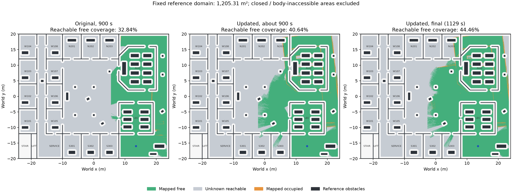
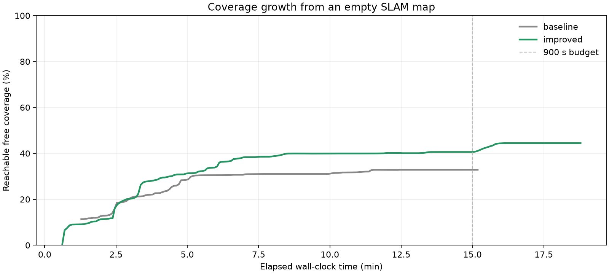

# 教学楼探索覆盖率验证

此前 train_000 的截图来自约 52 秒、2 个目标的进展测试。按下面的固定分母重算，
自由栅格覆盖率仅 10.33%；173.76 m² 是已知地图面积，包含障碍，不能用作覆盖率。

## 统计口径

评估器从 train_000 的参考 PGM、建筑边界和出生点生成固定分母：
满足 0.47 m 车体净空、与出生点四连通的自由栅格。此场景共 482,123 个栅格，
对应 1,205.3075 m²。封闭楼梯、电梯和无法穿过的狭缝不进入分母。
这表示车体中心可以到达的位置面积，不等同于建筑面积。

分子是这些参考位置在实时 SLAM 地图中被标为自由（0～20）的数量。
地图外和未知位置均未覆盖；墙和地图向楼外扩张不增加自由覆盖率。
另报已知覆盖率，便于区分未知与误标占用。固定使用仿真出生点变换对齐地图，
因此这是二维覆盖指标，不是地图几何精度指标；SLAM 漂移也可能影响分数。

参考地图只供 `coverage_watch.py` 评分。探索节点只读取实时地图、扫描和 TF，
不获取参考图、房间边界或覆盖率。

## 本次改动

- 目标按已知安全区域内的四连通最短通行距离评分，避免低估隔墙绕行代价。
  Nav2 仍计算实际路径，并在移动前检查整条路径的车体净空。
- 信息增益从观察点沿 360° 射线估计，遇到实时地图的已知障碍即停止，
  避免把隔墙不可见的未知面积当成观察收益。只用于评分，未知区域仍不可通行。
- 黑名单在候选数量截断之前应用，防止排名靠后的有效目标被饿死。
  全部暂时被排除时等待，不误报探索完成。
- 启动参数 `exploration_duration_s` 控制墙钟预算，默认保留 900 秒；0 取消时间上限。
  `duration_limit`、`blocked_frontiers` 和 `stalled` 均不表示完整覆盖。
- 探索模式的局部 Nav2 使用包住 0.47 m 车体半径的 32 边形，padding 为 0。
  全局规划轮廓另加栅格半对角线和 0.005 m 插值余量，内切半径约 0.5104 m。真实车型几何仍用于独立碰撞评分。
  两层地图都融合实时 SLAM，扫描层不覆盖未知区域。
- 连续路径检查计算圆形车体到占用/未知栅格矩形的精确距离，包含单个栅格内部的
  位置差异。实际起点与邻近安全栅格中心之间也必须通过完整路径检查。
- 探索模式使用 SmacPlanner2D，禁止未知区域与路径平滑。通过检查的路径直接发送
  到 `/follow_path`，避免导航树另行规划未经检查的路径；执行中定期检查剩余路径，
  地图新增障碍时取消并等待停止确认。
- 使用 Regulated Pure Pursuit，以前进和转向跟踪路径，保留碰撞预测；
  本控制模式暂不使用全向底盘的横移自由度。
- 新增只读覆盖率评估器，以固定分母记录随时间的变化。

## 实测结果

同一出生点、同一参考分母，从空 SLAM 图启动。原版完整 900 秒运行的可达自由覆盖率
为 **32.84%**，而此前 52 秒进展测试为 **10.33%**。
最终配置约 901.9 秒时保存的地图覆盖率为 **40.64%**，
相比原版同预算增加 **7.80 个百分点**。
继续运行后的最终保存地图覆盖率为 **44.46%**；
评分器墙钟 1110.7 秒，完成 18 个目标，
行驶 174.65 m。终止验收为 **FAIL: premature_stalled**，
停止确认 true。
本轮仍未验收全楼覆盖；时间更长的最终结果不能与原版 900 秒结果直接作为同预算提升比较。

原始/扩展底盘轮廓碰撞采样均为 0/0，
共 6887 次几何检查，最小采样 padded 净空 0.0520 m。
小场景回归为 **PASS: exhausted_verified**，
行驶 17.76 m，停止确认 true。
41 个行为回归用例通过；所有失败探测、源文件 SHA256 和安装一致性记录均保留在
[验证目录](validation/coverage_20261007/README.md)。





### 按房间覆盖

| 房间 | 可达自由覆盖率 |
|---|---:|
| W101 | 0.00% |
| W105 | 0.00% |
| W102 | 0.00% |
| W106 | 0.00% |
| W103 | 0.00% |
| W107 | 0.00% |
| W104 | 0.00% |
| W108 | 0.00% |
| N201 | 0.00% |
| N202 | 0.00% |
| N203 | 26.28% |
| S301 | 0.00% |
| S302 | 1.61% |
| S303 | 12.88% |
| SERVICE | 0.00% |
| AUD | 94.72% |
| LEC | 99.82% |

封闭楼梯、电梯的参考可达栅格为零，未列入此表。覆盖与精度分别评估：占用误标、回环漂移和多出生点稳定性仍需验收。

## 复现

在独立 ROS 仿真环境中构建工作区并加载 `install/setup.bash`，从空地图启动：

```bash
ros2 launch qianli_bringup training.launch.py variant:=train_000 \
  gui:=false rviz:=false slam:=true nav2:=true explore:=true \
  exploration_duration_s:=1800.0 exploration_report:=/tmp/explorer.json
```

同时启动只读评估器；参考场景必须与 variant 和出生点一致：

```bash
ros2 run qianli_exploration coverage_watch.py \
  --manifest src/qianli_training_scenarios/generated/train_000/manifest.json \
  --output /tmp/coverage.json
ros2 run qianli_exploration exploration_check.py \
  --manifest src/qianli_training_scenarios/generated/train_000/manifest.json \
  --duration 1830 --require-exhausted --output /tmp/check.json
```

`exploration_check.py` 默认的进展门槛会主动请求停止。全楼验证须使用
`--require-exhausted`，并同时检查最终覆盖率和终止原因。
仿真使用理想运动学和采样几何相交检查，不能替代真实车辆动力学、轮胎接触或实车安全验收。


局部层未知覆盖规则参考 [Nav2 Jazzy ObstacleLayer 实现](https://api.nav2.org/nav2-jazzy/html/obstacle__layer_8cpp_source.html)，
规划参数参考 [Smac2D 配置](https://docs.nav2.org/jazzy/configuration_and_development/configuration_guide/planners_plugins/smac/smac_2d/configuring_smac_2d/)。

路径跟踪参数参考 [Nav2 Jazzy RPP 配置](https://api.nav2.org/nav2-jazzy/html/md_nav2_regulated_pure_pursuit_controller_README.html)。
