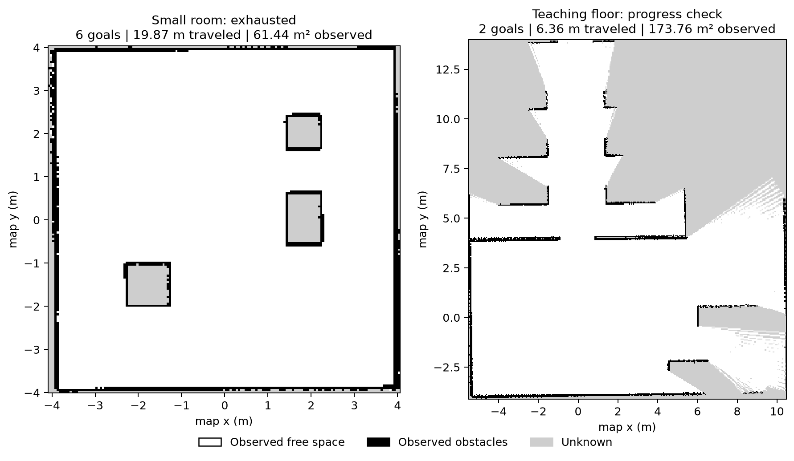

# Frontier Exploration v0.4 验收记录

本次实现以云端汇总分支为基础，不修改原虚拟机或 Windows 的硬件开发工作区。
仿真使用独立 `ROS_DOMAIN_ID=81` / `GZ_PARTITION=qianli_exploration_v1`，
回归测试使用 Domain 82；所有自动移动仅发生在临时仿真工作区。

## 已完成的源码验证

- 11 个包独立构建成功。
- 9 个地图算法、8 个 ROS action 生命周期和 5 个扫描转换测试通过（共 22 个行为用例）。
  colcon 将三个测试入口计为 6 条结果记录，均无失败。
- 首次回归暴露 ROS Node `clients` 只读属性命名冲突，已改用 `nav_clients` 并复测。
- 第一次仿真启动仍使用旧安装副本，保留失败日志后重建探索包再启动。

## 仿真验收

白色为已观察空地，黑色为已观察障碍，灰色仍未知。教学楼图显示有限进展测试结束时的实际地图。

### 小场景：通过 frontier 耗尽验收

`qianli_bringup sim.launch.py slam:=true nav2:=true explore:=true`，
从空地图、(0, 0) 出生点启动。策略仅观察实时地图、扫描和 TF。

| 指标 | 实测 |
|---|---:|
| 结果 | PASS / exhausted_verified |
| 自主到达观察点 | 6 |
| 已知栅格 | 1,475 → 24,576（+23,101） |
| 已知面积（空地与障碍） | 3.69 → 61.44 m² |
| 实际行驶路程 | 19.87 m |
| 观测墙钟时长 | 143.06 s |
| 原始/扩展轮廓相交采样 | 0 / 0 |
| 几何采样数 | 866 |
| 最小扩展轮廓净空 | 0.048 m |
| 停止确认 | true |

验收要求至少 1 个成功目标、0.6 m 路程、500 个栅格增长，并达到 frontier 耗尽；
本次终止时还有 15 个零碎边界栅格，没有达到 0.35 m 最小聚类尺寸。
这是符合当前筛选尺度的探索完成，不是所有未知像素消失。

原始观测结果：[small/check.json](validation/frontier_v04_20261006/small/check.json)。
实际扫描地图：[PGM](validation/frontier_v04_20261006/small/observed_map.pgm) /
[YAML](validation/frontier_v04_20261006/small/observed_map.yaml)。
源码、场景及配置 SHA-256：[provenance.json](validation/frontier_v04_20261006/provenance.json)。
已核对安装脚本与测试源码哈希一致，避免运行旧安装副本。

### 教学楼 train_000

`qianli_bringup training.launch.py variant:=train_000 slam:=true nav2:=true explore:=true`，
默认出生点 (13.5, -16.0, 0)，从空地图启动。达到进展门槛后由观测器请求停止。

| 指标 | 实测 |
|---|---:|
| 结果 | PASS / growth_verified |
| 自主到达观察点 | 2 |
| 已知栅格 | 1,441 → 69,504（+68,063） |
| 已知面积（空地与障碍） | 3.60 → 173.76 m² |
| 实际行驶路程 | 6.36 m |
| 观测墙钟时长 | 51.57 s |
| 原始/扩展轮廓相交采样 | 0 / 0 |
| 几何采样数 | 294 |
| 最小扩展轮廓净空 | 0.233 m |
| 停止确认 | true |

门槛为至少 2 个成功目标、2 m 路程和 2,000 个栅格增长。
本次结果验证了教学楼中的自主探索进展，没有要求整栋楼 frontier 耗尽，不能视为全楼覆盖验收。

原始观测结果：[train_000/check.json](validation/frontier_v04_20261006/train_000/check.json)。
实际扫描地图：[PGM](validation/frontier_v04_20261006/train_000/observed_map.pgm) /
[YAML](validation/frontier_v04_20261006/train_000/observed_map.yaml)。

小场景和教学楼均使用最终扫描适配器、SLAM 参数和探索配置；成功记录已核对源码哈希。
构建日志：[build.txt](validation/frontier_v04_20261006/build.txt)，
回归测试日志：[tests.txt](validation/frontier_v04_20261006/tests.txt)。

## 本次仿真定位并修复的问题

- Nav2 action 已被发现时，生命周期节点仍可能未激活；探索节点改为先检查四个服务状态。
- 初次 Spin 被拒绝不得视为观察完成；现在重试并在反复失败时停止。
- 旧 SLAM 配置仅按平移过滤扫描，原地转动后地图停在 1,475 栅格。
  启用 `check_min_dist_and_heading_precisely` 后接受纯转动扫描。
- 原始观察点过于贴近未知边界，NavFn 的最终接近段可能切过未知拐角。
  加入全局未知边界 inflation 与观察点 0.10 m 内侧余量；路径连通性保持原车体净空。
- 稀疏地图和窄道造成的“无安全目标”改为 `blocked_frontiers`，避免误报 `exhausted`。
- 评分在取消期间继续检查几何相交；停止确认前出现碰撞仍判失败。
- 教学楼长走廊中，Gazebo 无命中的 `+inf` 射线没有被 Karto 清空，车身附近留下
  未知缝隙。仿真适配器保留原始扫描，仅在有限回波比例足够时转换无命中值；
  建图截断小于转换值，避免虚假障碍端点。整帧 infinity 仍无效。

小场景前一次运行完成 3 个目标、地图增长 22,391 栅格，但残余拐角路径不安全，
最终 `premature_stalled`，未计入通过结果；修正后从空地图重新启动并通过上述验收。

参数语义参考 [SLAM Toolbox Jazzy 实现](https://github.com/SteveMacenski/slam_toolbox/blob/jazzy/src/slam_toolbox_common.cpp)
、[Karto 射线清空与端点判定](https://github.com/SteveMacenski/slam_toolbox/blob/jazzy/lib/karto_sdk/include/karto_sdk/Karto.h)
与 [Nav2 Jazzy inflation 文档](https://docs.nav2.org/jazzy/configuration_and_development/configuration_guide/core_servers/costmap_2d/costmap_plugins/inflation/)。

## 验证范围

当前验证二维、静态环境中的确定性探索基线，尚未训练探索目标选择模型。
已知面积包含空地和障碍；不作为整栋楼覆盖率。
独立评分侧读取 Gazebo 真值及场景几何，策略不接收这些输入。
小场景 866 次、教学楼 294 次几何采样未见相交，不等价于连续时间的碰撞证明。
整栋楼长时覆盖、多出生点、回环误差、真实雷达和实际轮子动力学仍待验收。
